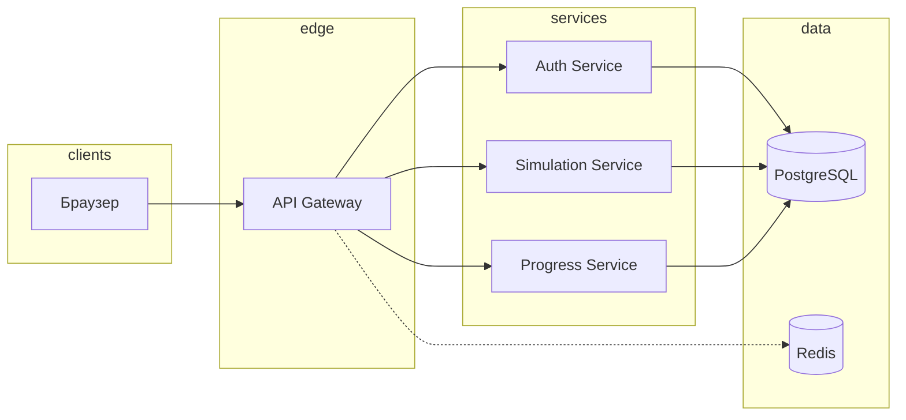

# Архитектура

## Обзор

Monorepo с микросервисами на **FastAPI**, фронтендом **Next.js**, **PostgreSQL** (отдельные БД на сервис), **Redis** (кэш и будущие WebSocket-сессии), единой точкой входа **API Gateway**.

## Шлюз

- Проксирование `/api/v1/auth/*`, `/api/v1/simulation/*`, `/api/v1/progress/*`.
- CORS по переменной `GATEWAY_CORS_ORIGINS`.
- Общий секрет `JWT_SECRET` с Auth Service для будущей валидации на шлюзе (ротация — через секреты оркестратора).

## TLS (продакшен)

Контейнеры слушают HTTP. Терминация TLS на **Ingress / reverse proxy** (Traefik, Cilium Gateway, Nginx): `https` → gateway:8000. Включите HSTS, ограничение размеров тела, rate limit на уровне edge.

## Сервисы (дорожная карта)

| Сервис      | БД            | Назначение                          |
|------------|---------------|-------------------------------------|
| auth       | `auth_db`     | Пользователи, JWT, refresh-токены |
| simulation | `simulation_db` | JSON-сценарии, шаги, проверки     |
| progress   | `progress_db` | HP, уровень, статистика            |

Сейчас `simulation-service` и `progress-service` подняты с `/health` и готовы к наполнению доменной логикой.
