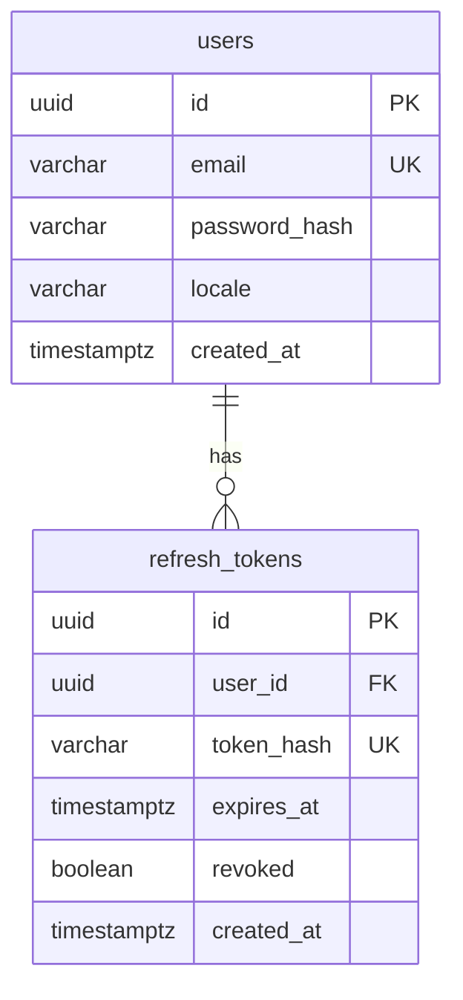
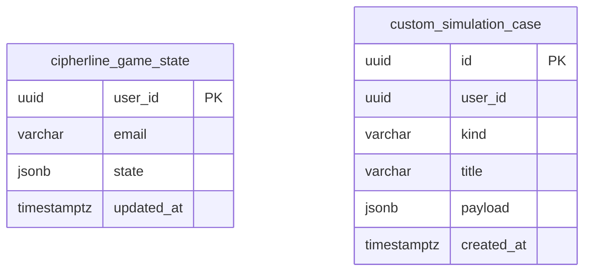

# ER-диаграмма (Auth Service)

Сервис аутентификации использует отдельную БД `auth_db`. Ниже — основные сущности на текущем этапе.

Пароли хранятся только в виде bcrypt-хэша. Сырой refresh-токен клиенту отдаётся один раз; в БД сохраняется SHA-256 хэш.

---

## Progress Service (`progress_db`)

Состояние тренажёра (HP, XP, модули, история ответов) хранится в JSONB; лидерборд и статистика читают те же данные.

- **`user_id`** совпадает с `users.id` из `auth_db` (логическая связь между сервисами; физический FK не обязателен при раздельных БД).
- **`state`** — полный объект прогресса клиента (сценарии, ответы, сертификат и т.д.).
- **`custom_simulation_case`** — сгенерированные через AI и сохранённые пользователем одношаговые кейсы (почта/чат); идентификатор в API `cs-mail-{uuid}` / `cs-chat-{uuid}`.
