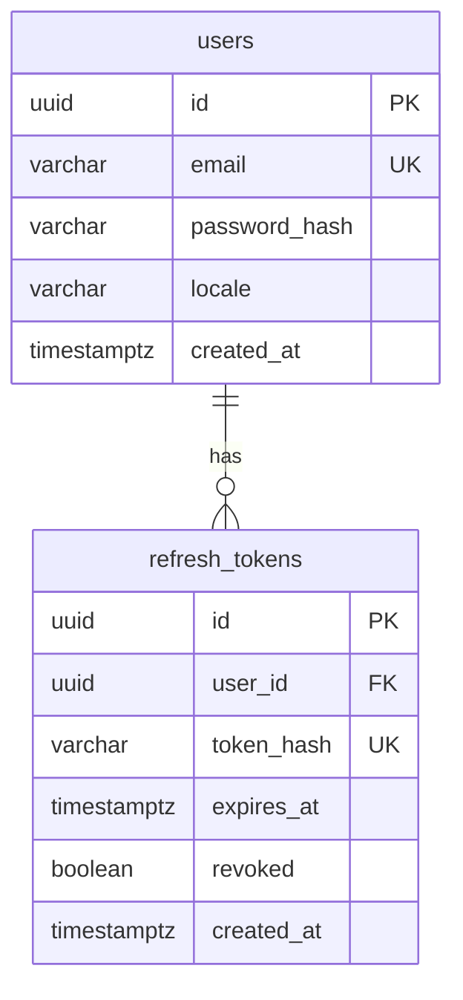

# ER-диаграмма (Auth Service)

Сервис аутентификации использует отдельную БД `auth_db`. Ниже — основные сущности на текущем этапе.

Пароли хранятся только в виде bcrypt-хэша. Сырой refresh-токен клиенту отдаётся один раз; в БД сохраняется SHA-256 хэш.
